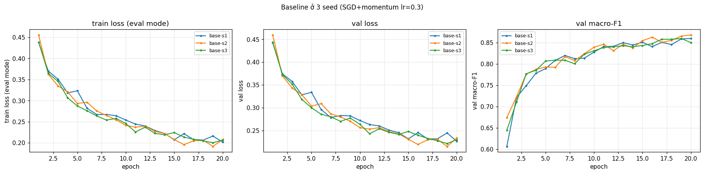
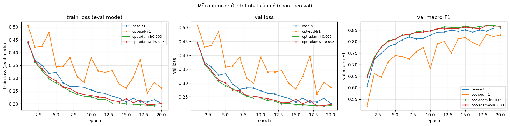

# Báo cáo Lab Day 1 — Phạm Minh Hiếu — 2A202602919

## 1. Thiết lập

- **Môi trường:** Google Colab, GPU Tesla T4, PyTorch 2.11.0+cu130. Toàn bộ dữ liệu nằm sẵn trên GPU, tự xáo bằng `randperm` mỗi epoch (không dùng `DataLoader`). Tổng thời gian huấn luyện của 39 lần chạy ≈ 21 phút.
- **Dữ liệu:** Forest CoverType; `train` 464 809 / `eval` 116 203 theo `split_metadata.csv`. Validation: 20% của train (phân tầng, seed 42) → 371 847 train / 92 962 val. Chuẩn hoá 10 cột số bằng mean/std của phần train còn lại; 44 cột one-hot giữ nguyên.
- **Model:** `M-base` (54→256→128→7, 47 879 tham số, `assert` trong code). Baseline: cross-entropy, SGD+momentum 0.9, **lr = 0.3** (chọn bằng val, mục 3.3), batch 512, 20 epoch, khởi tạo He (`kaiming_normal_`, bias = 0), không dropout/clip, FP32.
- **Quy ước đo:** số liệu lấy tại *best epoch* (val loss thấp nhất). Train loss đo ở chế độ `eval()` trên 50 000 mẫu train cố định. `grad_norm` là chuẩn L2 toàn cục đo **trước** khi clip. Thời gian/epoch chỉ tính phần huấn luyện.
- **Mốc tham chiếu:** accuracy "đoán lớp đa số" trên val = **0.4876** (macro-F1 = 0.0936).
- **Các chủ đề đã thử:** ☑ loss ☑ optimizer ☑ hyper-parameter ☑ dropout ☑ clipping ☑ mixed precision ☑ init (39 dòng trong `experiments.xlsx`).

## 2. Kiểm tra ban đầu và độ nhiễu

| Kiểm tra | Kết quả |
|---|---|
| Số tham số / shape logits | 47 879 / (B, 7) |
| Loss bước 0 (so với ln 7 = 1.946) | 2.3776 (Part 1, seed 42); 2.2691 / 1.9782 / 1.9005 cho `base-s1/s2/s3` |
| Quá khớp 20 mẫu: loss cuối | 0.00068 sau 300 bước Adam, accuracy 100% |
| Mọi tham số có gradient khác 0 | ☑ có (grad norm 0.38–2.37 cho W1, b1, W2, b2, W3, b3) |
| Baseline, số seed đã chạy | 3 (`base-s1`, `base-s2`, `base-s3`) |
| Baseline: val acc (TB ± σ) | 0.9127 ± 0.0023 |
| Baseline: val macro-F1 (TB ± σ) | 0.8616 ± 0.0032 |

**Ngưỡng nhiễu dùng trong báo cáo:** 2σ = **0.0064** (val macro-F1, σ mẫu của 3 seed). Với chỉ 3 seed, σ chỉ là ước lượng thô. Các chênh lệch chỉ nhỉnh hơn 2σ một chút từ **một** seed được coi là bằng chứng yếu.

Loss bước 0 lệch khỏi ln 7 vì lớp cuối cũng khởi tạo He nên logit có std ≈ 0.58. Mục 3.7 kiểm chứng điều này: loss bước 0 tăng dần theo độ lớn của logit. Đường cong baseline (`figures/base-s1.png`) giảm đều và **chưa quá khớp**: ở epoch cuối train/val loss = 0.2014 / 0.2263, best epoch là 20/19/19, tức val vẫn đang giảm khi dừng. Vậy mô hình đang *chưa khớp* (thiếu bước cập nhật), điều này giải thích phần lớn kết quả bên dưới.

## 3. Kết quả theo chủ đề

### 3.1 Hàm mất mát — CE vs MSE
- **Dự đoán:** MSE trên logit thô cho gradient 2(z − t)/7, nhỏ hơn và không "kéo mạnh" khi dự đoán sai nặng như CE (p − y), nên học chậm hơn, nhất là ở lớp hiếm. Thử thêm lr ×3 để bù gradient nhỏ.
- **Kết quả:** `loss-mse-lr0.3`: acc 0.8812, macro-F1 **0.7735** (−0.0881 so với TB baseline). `loss-mse-lr0.9`: acc 0.8596, F1 0.7489. Cả hai vượt xa 2σ. Ảnh: `figures/compare_loss.png`.
- **Giải thích:** đúng chiều dự đoán. Số đo xác nhận cơ chế gradient: trung vị grad norm của MSE là 0.065, so với 0.347 của CE (nhỏ hơn ~5 lần). Macro-F1 giảm (−0.088) gần gấp 3 lần accuracy giảm (−0.032), tức lớp hiếm bị ảnh hưởng nặng nhất. MSE bắt mọi logit hồi quy về đúng 0/1, kể cả ở mẫu đã phân loại đúng, nên tốn năng lực vào việc không ảnh hưởng tới argmax. CE chỉ quan tâm logit đúng có lớn hơn các logit khác không. **Khác dự đoán:** lr ×3 không bù được mà còn tệ hơn, nên vấn đề không chỉ nằm ở độ lớn gradient. Lý do chính xác chưa được kiểm chứng. Không so trực tiếp giá trị loss CE với MSE vì khác thang đo.

### 3.2 Bộ tối ưu hoá
- **Dự đoán:** Adam/AdamW hội tụ nhanh hơn ở đầu nhờ bước thích nghi theo từng tham số. Khi mỗi bộ được chỉnh lr thì khoảng cách nhỏ lại. AdamW (wd = 0.01) ≈ Adam.
- **Mỗi bộ ở lr tốt nhất của nó** (3 lr cho mỗi bộ; SGD+momentum dò 4 lr ở mục 3.3):

| Bộ tối ưu | exp_id | lr | val macro-F1 | best epoch |
|---|---|---|---|---|
| SGD (không momentum) | `opt-sgd-lr1` | 1.0 | 0.8314 | 18 |
| SGD+momentum 0.9 | `base-s1..s3` | 0.3 | 0.8616 ± 0.0032 | 20/19/19 |
| Adam | `opt-adam-lr0.003` | 0.003 | **0.8702** | 19 |
| AdamW (wd = 0.01) | `opt-adamw-lr0.003` | 0.003 | 0.8690 | 18 |

- **Độ nhạy với lr** (`figures/compare_optimizer_lr.png`): cả bốn bộ đều nhạy với lr. F1 giảm 0.07–0.09 khi lr nhỏ hơn 10 lần (ví dụ Adam: 0.7878 → 0.8446 → 0.8702 ở 3e-4 → 1e-3 → 3e-3). Thời gian/epoch của Adam lớn hơn khoảng 20% (1.54 s so với 1.27 s) vì phải cập nhật thêm m, v.
- **Giải thích:** Adam hơn SGD+momentum +0.0086 (vượt 2σ = 0.0064 nhưng chỉ sát ngưỡng, 1 seed), và học nhanh hơn ở đầu (macro-F1 epoch 1: 0.651 so với 0.606). Điều này hợp với việc Adam chia bước theo √v̂ của từng tham số: trọng số nối với các cột Soil_Type hiếm có gradient thưa nhưng vẫn nhận bước đủ lớn. Adam và AdamW khác nhau dưới 2σ ở cả 3 lr (≤ 0.0043), vì wd = 0.01 quá nhỏ để thay đổi gì trong 20 epoch. SGD thường kém nhất kể cả ở lr = 1.0 (tương đương bước hiệu dụng lr/(1−μ) = 1.0 của SGD+momentum lr 0.1, vốn đạt 0.8502 ở `hp-sgdm-lr0.1`). Momentum còn giúp làm mượt nhiễu của gradient lô. **Hạn chế quan trọng:** lr tốt nhất của mọi bộ đều nằm ở **mép lưới**, nên kết luận "Adam thắng" chỉ đúng trong lưới đã thử.

### 3.3 Hyper-parameter
- **lr (SGD+momentum, seed 0):** 0.01 → 0.7661; 0.03 → 0.8216; 0.1 → 0.8502; 0.3 → **0.8590** (`hp-sgdm-lr*`, `figures/compare_lr.png`). Mình dự đoán lr tốt nhất là 0.1 và đã sai: mô hình chưa khớp nên lr lớn hơn đi được xa hơn trong cùng 14 540 bước. lr được dò bằng seed 0 rồi baseline đo bằng seed 1–3, để số baseline không bị lạc quan do chọn đúng lần chạy may mắn.
- **Batch size** (cùng 20 epoch, nên số bước cập nhật khác nhau):

| exp_id | batch / lr | bước/epoch | val macro-F1 | Δ vs base | thời gian/epoch |
|---|---|---|---|---|---|
| `hp-batch128` | 128 / 0.3 | 2 906 | 0.7965 | −0.0651 | 5.41 s |
| `base-s1` | 512 / 0.3 | 727 | 0.8599 | — | 1.27 s |
| `hp-batch2048` | 2048 / 0.3 | 182 | 0.8375 | −0.0241 | 0.35 s |
| `hp-batch2048-lrx4` | 2048 / 1.2 | 182 | 0.0936 (sụp) | — | 0.35 s |

  Batch 2048 ít bước hơn 4 lần nên chưa khớp hơn (train loss 0.2285 so với 0.2014), dù nhanh hơn 3.7 lần mỗi epoch. **Trái dự đoán**, batch 128 *tệ hơn* dù có gấp 4 lần số bước. Ở cùng lr 0.3, gradient lô 128 nhiễu gấp ~4 lần về phương sai: grad norm trung vị 0.436 so với 0.347, có gai tới 4.7. Vì vậy mô hình dao động ở mức loss cao hơn (train loss 0.2957). Theo quy tắc tăng lr theo lô thì batch 128 cần lr ≈ 0.075, nên giữ 0.3 cũng giống dùng lr quá lớn 4 lần. Ngược lại, áp dụng quy tắc cho batch 2048 (lr ×4 = 1.2, không warmup) làm mạng **sụp**: ở epoch 1 grad norm vọt lên 14.8, sau đó train loss đứng yên ở 1.202, bằng đúng entropy của phân bố lớp (1.205). Nghĩa là mạng chỉ còn xuất ra tần suất lớp, gần như mọi ReLU đã "chết". Quy tắc này cần warmup đúng như slide nêu.
- **Độ rộng / độ sâu:** `hp-wide` (161 287 tham số) đạt **0.8749** (+0.0133, vượt 2σ), khớp dự đoán: thêm năng lực có ích khi đang chưa khớp. Khoảng cách val−train tăng nhẹ (0.033 so với 0.025), thời gian gần như không đổi (1.37 s). `hp-deep` **trái dự đoán**: macro-F1 0.8434 (−0.0182), dù accuracy bằng hệt baseline (0.9127) và val loss tốt hơn chút (0.2242). Tức là tổng thể như nhau nhưng kém ở lớp hiếm. Mình chưa giải thích được. Có thể do F1 của lớp 3 (~440 mẫu val) rất dao động khi chỉ có 1 seed, hoặc do nút thắt 64 nơ-ron. Cần thêm seed mới kết luận được.

### 3.4 Dropout
- **Kết quả** (`drop-*`, `figures/compare_dropout.png`):

| q | val macro-F1 | Δ vs base | val − train loss (epoch cuối) |
|---|---|---|---|
| 0 (`base-s1`) | 0.8599 | — | 0.0249 |
| 0.1 | 0.8411 | −0.0205 | 0.0130 |
| 0.3 | 0.7751 | −0.0865 | 0.0033 |
| 0.5 | 0.6548 | −0.2068 | 0.0033 |

- **Mô hình có đang quá khớp không?** Không. Khoảng cách val − train của baseline chỉ 0.025 và val loss còn giảm ở epoch 20. Dropout thu hẹp khoảng cách này (0.025 → 0.003), tức nó đang chính quy hoá đúng như lý thuyết. Nhưng vì vấn đề thật là *chưa khớp*, việc giảm năng lực hiệu dụng (mỗi bước chỉ cập nhật một mạng con) làm cả train lẫn val loss tăng, và F1 giảm đơn điệu theo q, đúng như dự đoán. Train loss được đo ở `eval()`, nên mức tăng này không phải do nơ-ron bị tắt lúc đo.

### 3.5 Gradient clipping
- **Ở lr bình thường (0.3), clipping có kích hoạt không?** Có. Mình chọn c = 0.35 bằng trung vị grad norm từng bước của `base-s1` (0.347; p90 = 0.407). Với `clip-c0.35`, clipping cắt **66%** số bước. Kết quả F1 0.8523 (−0.0093, vượt 2σ nhưng sát ngưỡng), hai đường cong gần như trùng nhau. Trái dự đoán "không đổi": cắt 2/3 số bước tương đương giảm lr hiệu dụng, mà mô hình đang chưa khớp nên đi chậm hơn một chút.
- **Ở lr cao (×10 = 3.0), clipping có cứu được huấn luyện không?** Chỉ cứu một phần (`figures/compare_clipping.png`):
  - Không clip (`clip-none-highlr`): ngay epoch 1 grad norm lớn nhất lên **7 880**, mạng sụp về dự đoán tần suất lớp (loss 1.21 ≈ entropy 1.205, F1 0.0936) và đứng yên suốt 20 epoch.
  - Có clip (`clip-c0.35-highlr`): grad norm lớn nhất ở epoch 1 chỉ 3.7, không bùng nổ, loss ở mức ~0.97–1.05, thấp hơn mức sụp. Nhưng F1 chỉ 0.1920. Clipping chặn độ dài mỗi bước ở lr·c ≈ 1.05, vẫn quá lớn (cộng thêm momentum). Gradient nhỏ dần qua các epoch (0.38 → 0.11) và tỉ lệ bước bị cắt giảm từ 37% về 0, cho thấy nhiều ReLU đã chết.
  - **Kết luận:** clipping chữa các *gai* gradient hiếm gặp, không chữa được một lr quá lớn một cách hệ thống.
- Lưu ý: hai lần chạy bị sụp không sinh NaN nên cột `diverged` = N. Cờ này chỉ bắt NaN/inf, mình ghi rõ "sụp" ở cột `notes`.

### 3.6 Mixed precision

| exp_id | thời gian/epoch | bộ nhớ cực đại* | val macro-F1 | Δ vs base |
|---|---|---|---|---|
| `base-s1` (FP32) | 1.27 s (3 seed: 1.27–1.47 s) | 17.98 MB | 0.8599 | — |
| `amp-fp16` (+ GradScaler) | 1.88 s | 17.98 MB | 0.8569 | −0.0047 |
| `amp-bf16` | 1.66 s | 17.98 MB | 0.8563 | −0.0053 |

\*Bộ nhớ đo từ lúc tạo model, không tính dữ liệu.
- **Giải thích:** khớp dự đoán, mixed precision **không nhanh hơn** mà còn chậm hơn 48% (FP16) và 31% (BF16). Độ chính xác không đổi trong phạm vi nhiễu. Với mạng 47 879 tham số và lô 512, mỗi phép nhân ma trận rất nhỏ, nên thời gian bị chi phối bởi chi phí gọi kernel. Autocast còn thêm kernel ép kiểu ở mỗi lớp, và GradScaler thêm bước unscale/kiểm tra inf. GradScaler đã bỏ qua 3 bước đầu (hệ số khởi đầu 2¹⁶ gây tràn số nên nó tự giảm), đúng như cơ chế. `is_bf16_supported()` trả True, nhưng T4 (Turing) không có phần cứng BF16 nên BF16 chạy giả lập.
- **Vì sao FP16 cần nhân loss với s:** FP16 có 5 bit mũ (số thường nhỏ nhất ≈ 6e-5, lớn nhất 65 504), nên gradient nhỏ bị làm tròn về 0. BF16 có 8 bit mũ như FP32 (≈ 1e-38 … 3e38) nên không tràn dưới, chỉ kém chính xác hơn (7 bit phần định trị).
- **Hạn chế:** bộ nhớ cực đại giống hệt nhau vì đỉnh rơi vào bước đánh giá FP32 (lô 8 192), không phải lúc huấn luyện. Cách đo này không cho thấy được phần tiết kiệm bộ nhớ của AMP.

### 3.7 Khởi tạo tham số
Std của tiền kích hoạt sau mỗi Linear ở bước 0 (4 096 mẫu val) và kết quả:

| exp_id | Var[W] | std sau L1 / L2 / logit | loss bước 0 | val macro-F1 |
|---|---|---|---|---|
| `base-s1` (he) | 2/n_vào | 0.661 / 0.640 / 0.577 | 2.2691 | 0.8599 |
| `init-xavier` | 2/(n_vào+n_ra) | 0.276 / 0.218 / 0.192 | 2.0222 | 0.8541 |
| `init-default` | 1/(3·n_vào) | 0.274 / 0.113 / 0.0585 | 1.9830 | 0.8613 |
| `init-normal` | 0.01² | 0.0343 / 0.0038 / 0.0003 | 1.9460 | 0.8640 |
| `init-zeros` | 0 | 0 / 0 / 0 | 1.9459 | 0.0936 |

- **Std theo lớp khớp lý thuyết:** He giữ gần như không đổi. Xavier co ~0.8 lần mỗi lớp ReLU (√(2·256/384 · ½) ≈ 0.82, đo được 0.79). Default co ~0.41 lần (√(1/6), đo được 0.41). normal(0.01) co ~10 lần mỗi lớp. **Loss bước 0 tăng đơn điệu theo std của logit** (0.0003 → 1.946; 0.06 → 1.983; 0.19 → 2.022; 0.58 → 2.269). Kết quả này kiểm chứng lời giải thích ở Part 1.
- **`zeros` hỏng đúng như dự đoán:** W = 0 nên mọi kích hoạt ẩn bằng ReLU(0) = 0, và gradient của W1, W2, W3 đều bằng 0 (các nơ-ron đối xứng, lại không có tín hiệu). Chỉ bias lớp cuối học được, nên mô hình học đúng tần suất lớp: loss 1.205 = entropy, acc 0.4876, grad norm ≈ 0.04.
- **`normal(0.01)`:** khởi động chậm hơn (macro-F1 epoch 1 là 0.526 so với 0.606 của He) nhưng đuổi kịp từ khoảng epoch 6 (cuối cùng +0.0024, dưới 2σ). Mạng chỉ 3 lớp nên tín hiệu co 10³ lần vẫn chưa tắt hẳn, và lr 0.3 đủ lớn để trọng số lớn lên nhanh.
- **xavier / default:** khác He dưới hoặc sát 2σ (−0.0075 / −0.0003). Mạng 3 lớp quá nông để thấy hiện tượng tắt dần như biểu đồ 30 lớp trong slide. *Ngoại suy (không đo):* với hệ số 0.41 mỗi lớp, sau 30 lớp std còn ~10⁻¹², còn với Xavier (0.8) còn ~10⁻³. Khi đó việc chọn He hay Xavier mới quan trọng.

## 4. Đánh giá cuối trên tập eval

| Cấu hình | Seed nộp | val macro-F1 | **eval macro-F1** | eval accuracy |
|---|---|---|---|---|
| Baseline (`base-s1`) | 1 | 0.8599 | **0.8616** | 0.9108 |
| Cấu hình cuối cùng (`final-b-s1`) | 1 | 0.9243 | **0.9277** | 0.9530 |

- **Cấu hình cuối cùng và vì sao (chỉ dựa trên val):** lấy bộ tối ưu tốt nhất ở 3.2 (Adam lr 3e-3), rồi xử lý chẩn đoán "chưa khớp" ở mục 2 bằng **40 epoch + lr giảm theo cosine**, và thử thêm **M-wide** (vốn tốt hơn ở 3.3). `final-a-s1` (M-base) đạt val F1 0.9042, `final-b-s1` (M-wide) đạt 0.9243, nên chọn M-wide. Ba seed của cấu hình này cho val F1 0.9243 / 0.9226 / 0.9284 = **0.9251 ± 0.0030**. Cấu hình đổi nhiều yếu tố cùng lúc nên không quy được toàn bộ cải thiện cho một yếu tố. So với `opt-adam-lr0.003` (0.8702, 20 epoch), phần lớn lợi ích đến từ huấn luyện lâu hơn với lr giảm dần (+0.034 ở M-base), M-wide thêm +0.020.
- **Cải thiện so với baseline trên eval:** +0.0661 (0.8616 → 0.9277), gấp ~10 lần ngưỡng nhiễu 2σ = 0.0064. Trên val, chênh lệch giữa trung bình 3 seed là +0.0635. Eval chỉ được chạy cho seed 1 của mỗi cấu hình, nên không có σ riêng cho eval.
- **Val và eval gần nhau:** eval − val = +0.0017 (baseline) và +0.0034 (cuối). Hai tập cùng phân bố (chia phân tầng) và cấu hình không được chọn bằng eval. Eval chỉ chạy một lần cho mỗi mô hình, sau khi đã chốt cấu hình.

### 4.1 Phân tích lỗi theo lớp (cấu hình cuối, `eval_result.json`)

| Lớp | support | precision | recall | F1 |
|---|---|---|---|---|
| 0 Spruce/Fir | 42 368 | 0.9545 | 0.9465 | 0.9505 |
| 1 Lodgepole Pine | 56 661 | 0.9558 | 0.9640 | 0.9599 |
| 2 Ponderosa Pine | 7 151 | 0.9525 | 0.9508 | 0.9516 |
| 3 Cottonwood/Willow | 549 | 0.8879 | 0.8652 | **0.8764** |
| 4 Aspen | 1 899 | 0.8952 | 0.8636 | 0.8791 |
| 5 Douglas-fir | 3 473 | 0.9172 | 0.9122 | 0.9147 |
| 6 Krummholz | 4 102 | 0.9638 | 0.9595 | 0.9616 |

- **Lớp khó nhất là lớp 3** (F1 = 0.8764). Trong 549 mẫu của nó, 55 mẫu (10.0%) bị đoán thành **lớp 2** và 19 mẫu (3.5%) thành lớp 5. Chiều ngược lại cũng vậy: phần lớn dự đoán sai *thành* lớp 3 đến từ lớp 2 (38) và lớp 5 (22). Lớp khó thứ hai là **lớp 4** (F1 0.8791): 201/1 899 mẫu (10.6%) bị đoán thành lớp 1.
- **Lý giải bằng dữ liệu:**
  - Lớp 3 chỉ có 2 198 mẫu train (0.47%), ít hơn lớp 1 khoảng 100 lần, nên đóng góp rất ít vào loss trung bình.
  - Lớp 3 cũng trùng đặc trưng với lớp 2 và 5: độ cao trên train lần lượt là 2 224 ± 102 m, 2 394 ± 196 m và 2 419 ± 189 m. Cả ba là các loại rừng ở độ cao thấp, khoảng độ cao chồng lên nhau. Tương tự, lớp 4 (2 788 ± 97 m) nằm gọn trong khoảng của lớp 1 (2 921 ± 186 m).
  - Nhầm lẫn lớn nhất về số lượng là giữa lớp 0 và 1 (2 108 + 1 737 mẫu), nhưng chỉ chiếm 5.0% và 3.1% của hai lớp lớn này nên ảnh hưởng tới macro-F1 nhỏ.
- **So với baseline:** F1 của lớp 3 tăng từ 0.7868 lên 0.8764, của lớp 4 từ 0.7693 lên 0.8791. Recall lớp 3 tăng mạnh nhất (0.696 → 0.865): ở baseline có 130/549 mẫu lớp 3 (23.7%) bị nhầm sang lớp 2.
- **Cách cải thiện sẽ thử:** đánh trọng số lớp trong CE (tỉ lệ nghịch với tần suất) hoặc lấy mẫu dư lớp 3/4 để tăng recall lớp hiếm, rồi chọn trọng số bằng val macro-F1.

## 5. Trả lời các câu hỏi dẫn dắt

1. **Bộ tối ưu nào "thắng" khi chỉnh lr công bằng?** Adam ≈ AdamW (0.8702 / 0.8690) > SGD+momentum (0.8616 ± 0.0032) > SGD (0.8314). Adam hơn SGD+momentum 0.0086, chỉ sát ngưỡng 2σ và từ 1 seed, nên là bằng chứng yếu, và lr tốt nhất nằm ở mép lưới. **Khi không chỉnh lr, kết luận đảo chiều tuỳ lr đem so:** Adam lr 3e-4 (0.7878) thua SGD+momentum lr 0.3 tới 0.07, còn Adam lr 3e-3 thắng SGD+momentum lr 0.01 (0.7661) tới 0.10.
2. **Dropout có giúp khi mô hình chưa quá khớp?** Không. F1 giảm đơn điệu (−0.02 / −0.09 / −0.21 với q = 0.1 / 0.3 / 0.5), dù khoảng cách val−train có thu hẹp. Nên dùng dropout khi khoảng cách train–val lớn và tăng dần, ví dụ mô hình to hơn hoặc huấn luyện lâu hơn. `final-b-s1` có khoảng cách 0.053 nên có thể là chỗ đáng thử q nhỏ (chưa thử).
3. **Gradient clipping giải quyết vấn đề gì? Bằng chứng?** Nó chặn các bước cập nhật quá lớn khi gradient đột ngột bùng nổ. Ở lr 3.0, không clip thì grad norm lên 7 880 ở epoch 1 và mạng sụp (F1 0.094). Có clip thì grad norm lớn nhất chỉ 3.7 và mạng không sụp hoàn toàn (loss 0.97 so với 1.21). Nhưng clip không biến một lr quá lớn thành lr tốt (F1 0.19), và ở lr bình thường nó chỉ làm chậm một chút (−0.009).
4. **Mixed precision có nhanh hơn không?** Không: FP16 chậm hơn 48%, BF16 chậm hơn 31%, độ chính xác không đổi trong phạm vi nhiễu. Mạng và lô quá nhỏ nên chi phí gọi kernel chiếm ưu thế. Autocast và GradScaler thêm kernel, còn T4 không có phần cứng BF16. AMP chỉ có lợi khi phép nhân ma trận đủ lớn để tensor core phát huy.
5. **Vì sao khởi tạo toàn số 0 hỏng? He khác Xavier ở đâu?** Khi W = 0, mọi nơ-ron trong một lớp giống hệt nhau và nhận cùng gradient (ở đây gradient bằng 0 vì ReLU(0) = 0), nên không bao giờ phân hoá. Chỉ bias lớp cuối học, và `init-zeros` dừng ở tần suất lớp (acc 0.4876). He dùng Var = 2/n_vào để bù việc ReLU bỏ một nửa phương sai, nhờ đó std được giữ nguyên qua các lớp (đo được 0.66 → 0.64 → 0.58). Xavier giả định hàm kích hoạt tuyến tính/tanh nên std co khoảng 0.8 lần mỗi lớp ReLU (0.28 → 0.22 → 0.19). Khác biệt này không đáng kể với 3 lớp, nhưng quan trọng với mạng sâu (0.8³⁰ ≈ 10⁻³).
6. **Loss không giảm sau 2 000 bước: 3 phép kiểm tra đầu tiên:**
   - **(1) So loss hiện tại với hai mốc ln C và entropy phân bố lớp.** Ở bài này, ln C = 1.946 và entropy phân bố lớp = 1.205. Ba lần chạy hỏng của mình (`init-zeros`, `clip-none-highlr`, `hp-batch2048-lrx4`) đều đứng yên đúng ở 1.20–1.21: dấu hiệu mạng chỉ học tần suất lớp vì gradient không chảy (khởi tạo đối xứng hoặc ReLU chết do lr quá lớn). Còn loss bước 0 lệch xa ln C thì do thang logit hoặc chuẩn hoá (mục 3.7).
   - **(2) Thử quá khớp một lô nhỏ** (20 mẫu, tắt chính quy hoá) để tách lỗi code (nhãn lệch, softmax hai lần, quên `zero_grad`, tham số không nằm trong optimizer) khỏi vấn đề tối ưu. Part 1 xuống tới 0.00068.
   - **(3) Ghi và xem `grad_norm` (trước clip) theo thời gian và theo lớp.** Gai rất lớn ở đầu (7 880, 14.8) rồi grad norm gần 0 nghĩa là lr quá cao làm ReLU chết: giảm lr, thêm warmup hoặc clip. Grad norm ≈ 0 ngay từ đầu nghĩa là khởi tạo sai hoặc gradient không chảy. Grad norm bình thường nhưng loss chỉ giảm chậm (như lr 0.01) thì cứ tăng lr.

## 6. Hạn chế và điều bất ngờ

- **Khác dự đoán:**
  - lr tốt nhất là 0.3 chứ không phải 0.1.
  - Batch 128 tệ hơn baseline dù nhiều bước hơn, vì giữ nguyên lr thì nhiễu gradient lớn hơn.
  - Quy tắc lr ×4 cho batch 2048 làm mạng sụp khi không có warmup.
  - MSE với lr ×3 còn tệ hơn.
  - Clipping ở lr thường làm giảm nhẹ F1 thay vì không đổi.
  - M-deep có accuracy bằng baseline nhưng macro-F1 thấp hơn (chưa giải thích được).
  - normal(0.01) đuổi kịp He sau ~6 epoch.
- **Điểm có thể làm kết luận sai:**
  - Chỉ 3 seed để ước lượng σ. Các thí nghiệm đơn yếu tố chỉ chạy 1 seed, nên các chênh lệch sát 2σ (Adam +0.0086, xavier −0.0075, clip −0.0093) là bằng chứng yếu.
  - lr tốt nhất nằm ở mép lưới với SGD+momentum, SGD và Adam.
  - lr không được dò lại cho từng biến thể (MSE, M-deep, dropout, batch), nên "tệ hơn" có thể chỉ là "tệ hơn ở lr này".
  - Cùng số epoch nhưng khác số bước ở thí nghiệm batch.
  - Dò lr bằng seed 0 còn các thí nghiệm khác dùng seed 1.
  - Cờ `diverged` chỉ bắt NaN/inf (ba lần chạy bị sụp vẫn ghi N, lý do ở `notes`).
  - Bộ nhớ cực đại bị chi phối bởi bước đánh giá.
  - Thời gian/epoch tự dao động khoảng ±0.1 s giữa các lần chạy giống nhau.
- **Nếu có thêm thời gian:**
  - Mở rộng lưới lr (Adam > 3e-3, SGD+momentum trong khoảng 0.3–3).
  - Batch lớn kèm warmup.
  - Trọng số lớp cho lớp 3/4.
  - Thêm seed cho các thí nghiệm sát ngưỡng và cho eval.
  - Thử dropout/weight decay nhỏ cho cấu hình cuối (đang có dấu hiệu quá khớp nhẹ).

## 7. Phụ lục

- **File nộp:** `REPORT.md`, `experiments.xlsx` (39 dòng; sheet Seeds = `base-s1..s3`), `predictions_eval.csv` (116 203 dòng, `final-b-s1`), `eval_result.json`, `figures/` (39 ảnh `<exp_id>.png` + 11 ảnh `compare_*.png`), `results/` (39 file `<exp_id>.json`; `results/eval/` chứa dự đoán và kết quả eval của baseline), `code/` (`lab.ipynb`, `data.py`, `model.py`, `optimizer.py`, `train.py`, `plots.py`, `results_table.py`).
- **Thời gian chạy:** khoảng 21 phút huấn luyện trên T4 cho 39 cấu hình. Thêm khoảng 2 phút để huấn luyện lại `base-s1` và `final-b-s1` trước khi dự đoán eval (kết quả val trùng khớp lần chạy đầu). Mỗi thí nghiệm lưu `results/<exp_id>.json` ngay khi xong nên notebook chạy lại được mà không phải huấn luyện lại.
